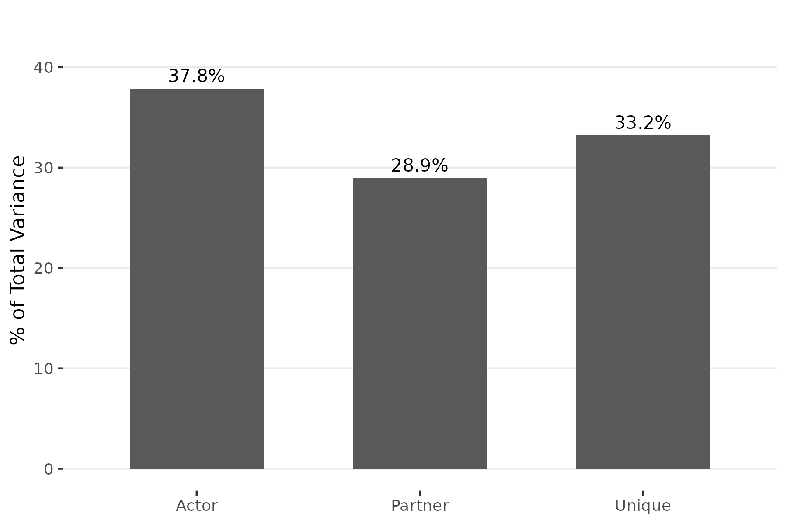
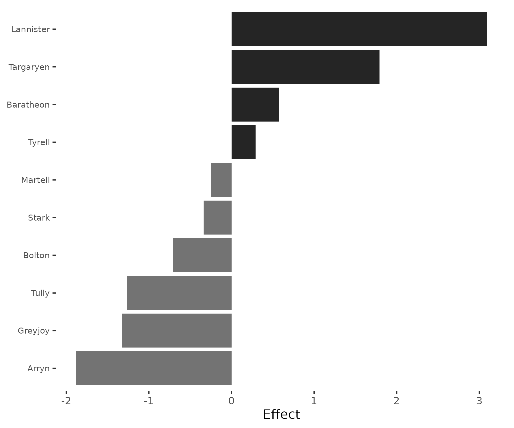
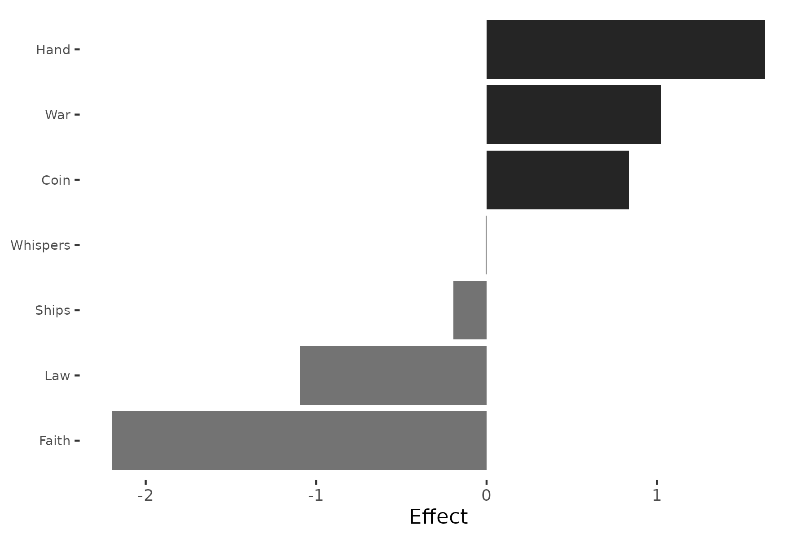
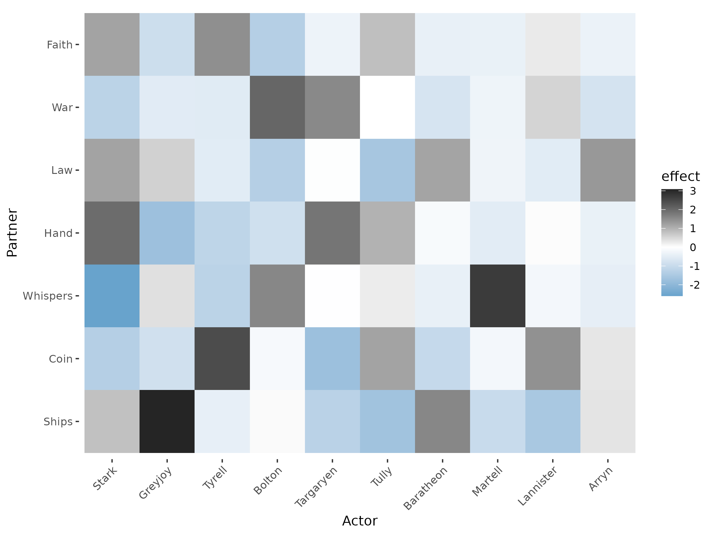
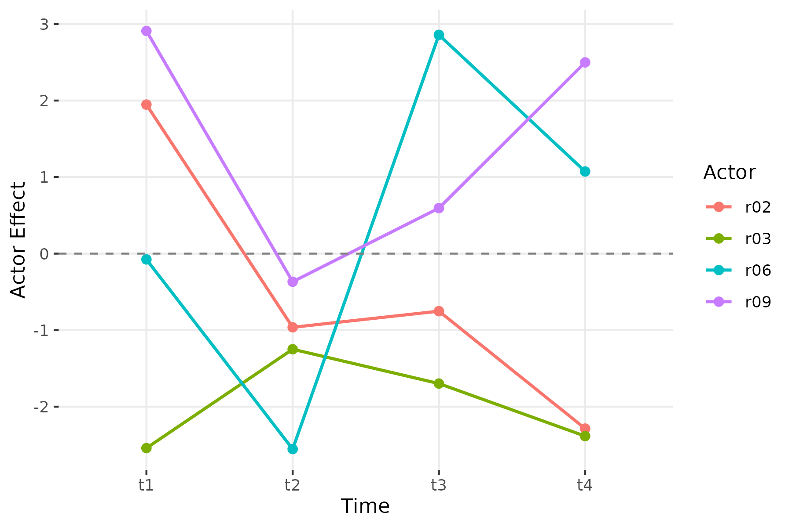

# Bipartite Networks: Two-Mode SRM Analysis

## Overview

The preceding vignettes focus on unipartite (one-mode) networks where
every actor can both send and receive ties. Many networks, however, are
**bipartite** (two-mode): senders and receivers come from different
populations. Countries send aid to organizations. Students enroll in
courses. Voters support candidates. In these settings, the SRM
decomposes variation into sender effects, receiver effects, and
dyad-specific residuals — but the covariance components (reciprocity,
actor-partner covariance) are not defined because no actor appears on
both sides.

This vignette walks through the bipartite SRM workflow using a *Game of
Thrones*-inspired dataset, then demonstrates simulation-based validation
and longitudinal two-mode analysis.

## The Small Council dataset

The `small_council` dataset is a 10 x 7 matrix of simulated “pursuit
intensity” scores. Each row is a Great House from Westeros; each column
is a Small Council position. The value in cell $(i,j)$ represents how
aggressively House $i$ pursues position $j$, on a 0–10 scale.

``` r
library(srm)
data(small_council)
small_council
          Hand Coin Whispers Ships  War Law Faith
Stark      8.7  4.6      2.5   5.7  4.9 5.2   4.1
Lannister 10.2 10.8      8.3   6.8 10.1 6.9   6.6
Targaryen 10.7  6.3      7.2   5.8  9.8 6.1   4.7
Baratheon  7.5  5.8      5.6   7.4  6.3 6.1   3.4
Tyrell     6.2  9.0      4.5   5.1  6.2 4.1   5.0
Martell    6.3  5.8      7.9   4.0  5.9 3.8   2.6
Greyjoy    4.0  4.1      4.5   7.0  4.6 3.6   1.0
Arryn      4.8  4.7      3.1   3.7  3.8 3.8   1.0
Tully      6.8  6.2      4.4   2.3  5.2 1.5   2.8
Bolton     5.5  5.4      6.3   4.6  7.8 2.3   1.2
```

The rows (Houses) and columns (positions) are distinct populations — a
House cannot be a position and vice versa. This makes the network
bipartite.

## Fitting the bipartite SRM

Pass the rectangular matrix directly to
[`srm()`](https://netify-dev.github.io/srm/reference/srm.md). The
function detects the non-square shape and applies the bipartite
decomposition automatically.

``` r
fit = srm(small_council)
fit
Social Relations Model
---------------------------------------- 
Mode:       bipartite
Actors:     10
Grand mean: 5.4357

Variance Decomposition:
  Actor          2.0486  ( 37.8%)
  Partner        1.5662  ( 28.9%)
  Unique         1.7980  ( 33.2%)
```

Three variance components are reported. Actor variance (37.8%) captures
differences in overall ambition across Houses — some Houses pursue all
positions aggressively while others are largely passive. Partner
variance (28.9%) captures how desirable each position is on average —
the Hand of the King is more sought after than the Master of Laws.
Unique variance (33.2%) captures house-position affinities that cannot
be explained by either side’s general tendency.

No covariance components appear because reciprocity and actor-partner
covariance are not defined when senders and receivers belong to
different populations.

``` r
plot(fit, type = "variance")
```



The roughly even three-way split means that network structure is driven
by a combination of which Houses are most ambitious, which positions are
most attractive, and which specific House-position pairings deviate from
those general patterns.

## Actor effects: which Houses are most ambitious?

``` r
plot(fit, type = "actor")
```



Lannister has the highest actor effect (+3.09), meaning it pursues Small
Council positions far more aggressively than the average House.
Targaryen (+1.79) is close behind — both are Houses with imperial
ambitions. At the other end, Arryn (-1.88) and Greyjoy (-1.32) show the
weakest overall pursuit. Arryn’s isolationism in the Vale and the
Greyjoys’ focus on the sea over court politics are consistent with low
engagement across positions.

## Partner effects: which positions are most coveted?

``` r
plot(fit, type = "partner")
```



The Hand of the King has the strongest partner effect (+1.63),
reflecting that nearly every House wants this role. Master of War
(+1.02) and Master of Coin (+0.83) are also widely pursued. At the
bottom, the High Septon / Faith representative (-2.20) and Master of
Laws (-1.10) attract the least interest.

## Unique effects: house-position affinities

The unique effects reveal which House-position pairings are stronger or
weaker than the general tendencies would predict.

``` r
plot(fit, type = "dyadic")
```



The heatmap highlights several distinctive affinities. The darkest cell
is Greyjoy pursuing Ships (+3.08) — the Ironborn’s obsession with naval
power is the strongest unique effect in the network. Martell pursues
Whispers (+2.72), reflecting the Dornish reputation for intrigue. Tyrell
pursues Coin (+2.44), consistent with their wealth and agricultural
power. Stark has a strong affinity for the Hand (+1.97) but uniquely
avoids Whispers (-2.59) — Ned Stark’s rigid honor made espionage
anathema.

We can extract the exact values:

``` r
u = fit$unique_effects[[1]]

# strongest positive affinities
top_pairs = sort(u[u != 0], decreasing = TRUE)[1:6]
round(top_pairs, 2)
[1] 3.08 2.72 2.44 2.05 1.97 1.84
```

``` r
# strongest negative affinities
bottom_pairs = sort(u[u != 0])[1:6]
round(bottom_pairs, 2)
[1] -2.59 -1.76 -1.75 -1.68 -1.58 -1.53
```

Stark avoiding Whispers (-2.59) is the strongest negative unique effect
— a House-position mismatch driven by values rather than capability.

## Bipartite decomposition: what changes

In the unipartite SRM, actor and partner effects use bias-corrected
formulas because the same individuals appear in both row and column
margins. In the bipartite case, rows and columns are distinct
populations, so effects are simple deviations from the grand mean:

$${\widehat{a}}_{i} = {\bar{X}}_{i \cdot} - \bar{X},\quad{\widehat{b}}_{j} = {\bar{X}}_{\cdot j} - \bar{X}$$

Variance components are still bias-corrected using two-way ANOVA degrees
of freedom:

$${\widehat{\sigma}}_{g}^{2} = \frac{\text{SS}_{\text{resid}}}{\left( n_{r} - 1 \right)\left( n_{c} - 1 \right)},\quad{\widehat{\sigma}}_{a}^{2} = \text{Var}\left( \widehat{a} \right) - \frac{{\widehat{\sigma}}_{g}^{2}}{n_{c}},\quad{\widehat{\sigma}}_{b}^{2} = \text{Var}\left( \widehat{b} \right) - \frac{{\widehat{\sigma}}_{g}^{2}}{n_{r}}$$

The bias correction subtracts the expected contribution of dyadic noise
to the marginal variances. Without it, actor and partner variances would
be inflated.

## Simulation validation

To verify the decomposition, we generate a bipartite network with known
parameters and check recovery:

``` r
sim = sim_srm(
  n_actors = c(15, 20),
  bipartite = TRUE,
  actor_var = 2.0,
  partner_var = 1.0,
  unique_var = 1.5,
  grand_mean = 3.0,
  seed = 6886
)

fit_sim = srm(sim$Y)
summary(fit_sim)
Social Relations Model - Variance Decomposition
================================================== 

Component                Variance  % Total
------------------------------------------ 
Actor                      1.6468    39.2%
Partner                    1.1406    27.2%
Unique                     1.4111    33.6%
```

``` r
data.frame(
  Component = c("Actor var", "Partner var", "Unique var"),
  True = c(2.0, 1.0, 1.5),
  Estimated = round(fit_sim$stats$variance, 2)
)
    Component True Estimated
1   Actor var  2.0      1.65
2 Partner var  1.0      1.14
3  Unique var  1.5      1.41
```

The estimates are in the right ballpark for a single draw from a 15 x 20
matrix. All three components are close to their true values, with the
sampling variability typical of moderate-sized bipartite networks. The
relative ordering is preserved: actor variance is largest, unique
variance is intermediate, and partner variance is smallest.

## Longitudinal bipartite analysis

Bipartite networks observed over time are handled the same way as
unipartite longitudinal data. Pass a named list of rectangular matrices
to [`srm()`](https://netify-dev.github.io/srm/reference/srm.md):

``` r
sim_long = sim_srm(
  n_actors = c(10, 12),
  n_time = 4,
  bipartite = TRUE,
  actor_var = 2.0,
  partner_var = 1.5,
  unique_var = 1.0,
  seed = 6886
)

fit_long = srm(sim_long$Y)
fit_long
Social Relations Model
---------------------------------------- 
Mode:       bipartite
Time points: 4
Actors:      10
Grand mean:  -0.7244 (avg)

Variance Decomposition:
  Actor          2.4594  ( 49.5%)
  Partner        1.4485  ( 29.2%)
  Unique         1.0604  ( 21.3%)
```

All longitudinal tools work with bipartite fits. We can track how sender
effects evolve:

``` r
srm_trend_plot(fit_long, type = "actor", n = 4)
```



And assess whether sender positions are stable across periods:

``` r
srm_stability(fit_long, type = "actor")
  time1 time2 correlation  n
1    t1    t2  0.05052448 10
2    t2    t3 -0.15593598 10
3    t3    t4  0.64377932 10
```

The correlations between consecutive periods reflect whether the same
senders maintain their relative positions over time. Because the
simulated data generates independent effects at each period,
correlations are modest.

We can do the same for receiver (partner) effects:

``` r
srm_stability(fit_long, type = "partner")
  time1 time2 correlation  n
1    t1    t2  -0.4152899 12
2    t2    t3  -0.1955600 12
3    t3    t4  -0.1182165 12
```

## Key differences from unipartite SRM

| Feature             | Unipartite                                                                                 | Bipartite                          |
|---------------------|--------------------------------------------------------------------------------------------|------------------------------------|
| Matrix shape        | Square ($n \times n$)                                                                      | Rectangular ($n_{r} \times n_{c}$) |
| Diagonal            | Set to zero                                                                                | No diagonal                        |
| Effect formulas     | Bias-corrected (finite-sample)                                                             | Simple deviations from grand mean  |
| Variance components | 5 (actor, partner, unique, relationship cov, actor-partner cov)                            | 3 (actor, partner, unique)         |
| Permutation testing | Supported via [`permute_srm()`](https://netify-dev.github.io/srm/reference/permute_srm.md) | Not yet supported                  |
| Minimum size        | $n \geq 3$ ($n \geq 4$ for variances)                                                      | $n_{r} \geq 2$, $n_{c} \geq 2$     |

The most important difference is conceptual: in unipartite networks,
every actor plays both sender and receiver roles, enabling reciprocity
analysis and actor-partner covariance. In bipartite networks, the two
roles are filled by distinct populations, so only marginal variances are
estimated.

## Summary

The bipartite SRM provides the same decomposition logic as the
unipartite case — partitioning network variation into sender effects,
receiver effects, and dyad-specific residuals — but adapted for networks
where rows and columns represent different populations. The `srm`
package handles this automatically when given a rectangular matrix.
Simulation, visualization, and longitudinal tools all work with
bipartite fits. The main limitation is that covariance components and
permutation testing are not available in two-mode settings.

## References

Dorff, Cassy, and Michael D. Ward. (2013). Networks, Dyads, and the
Social Relations Model. *Political Science Research Methods*
1(2):159-178.

Kenny, David A., and Lawrence La Voie. (1984). The Social Relations
Model. *Advances in Experimental Social Psychology* 18:141-182.
