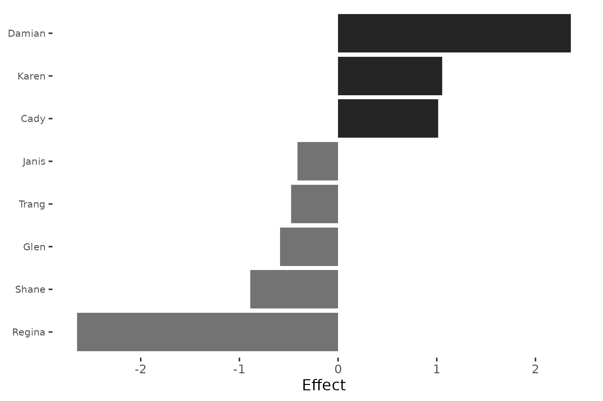

# SRM Methodology: Mathematical Framework

## Overview

The Social Relations Model (SRM) was originally developed by Kenny and
La Voie (1984) for round-robin designs in psychology, where every
individual both rates and is rated by every other individual. The
framework decomposes observed relational data into additive components
that capture systematic patterns at the actor level and
relationship-specific patterns at the dyadic level.

The `srm` package implements the SRM decomposition for network data,
extending its applicability to political science, international
relations, and other domains where relational data arises naturally.

## The Model

For a directed network with $n$ actors, let $X_{ij}$ denote the observed
tie from actor $i$ to actor $j$. The SRM decomposes this as:

$$X_{ij} = \mu + a_{i} + b_{j} + g_{ij}$$

where:

- $\mu$ is the **grand mean** of the network
- $a_{i}$ is the **actor effect** for individual $i$ (sender tendency)
- $b_{j}$ is the **partner effect** for individual $j$ (receiver
  tendency)
- $g_{ij}$ is the **unique (dyadic) effect** for the
  $\left. i\rightarrow j \right.$ relationship

### Interpretation

- **Actor effect** ($a_{i}$): How much actor $i$ sends ties above or
  below the network average, after adjusting for partner
  characteristics. A high positive $a_{i}$ means actor $i$ is an
  unusually active sender.

- **Partner effect** ($b_{j}$): How much actor $j$ receives ties above
  or below the network average, after adjusting for actor
  characteristics. A high positive $b_{j}$ means actor $j$ is an
  unusually attractive receiver.

- **Unique effect** ($g_{ij}$): The component of the
  $\left. i\rightarrow j \right.$ tie that cannot be explained by $i$’s
  general sending tendency or $j$’s general receiving tendency. This
  captures relationship-specific dynamics.

## Estimation

### Effect Estimates

The SRM effects are estimated using the following formulas. Let:

- $X_{i \cdot} = \frac{1}{n - 1}\sum_{j \neq i}X_{ij}$ (row mean for
  actor $i$)
- $X_{\cdot j} = \frac{1}{n - 1}\sum_{i \neq j}X_{ij}$ (column mean for
  actor $j$)
- $\bar{X} = \frac{1}{n(n - 1)}\sum_{i \neq j}X_{ij}$ (grand mean)

The estimated actor effect is:

$${\widehat{a}}_{i} = \frac{(n - 1)^{2}}{n(n - 2)}X_{i \cdot} + \frac{n - 1}{n(n - 2)}X_{\cdot i} - \frac{n - 1}{n - 2}\bar{X}$$

The estimated partner effect is:

$${\widehat{b}}_{j} = \frac{(n - 1)^{2}}{n(n - 2)}X_{\cdot j} + \frac{n - 1}{n(n - 2)}X_{j \cdot} - \frac{n - 1}{n - 2}\bar{X}$$

The estimated unique effect is simply the residual:

$${\widehat{g}}_{ij} = X_{ij} - {\widehat{a}}_{i} - {\widehat{b}}_{j} - \bar{X}$$

Note that these formulas include a correction for the finite-sample bias
that arises because row and column means are not independent.

### Variance Components

The SRM framework also estimates variance components that summarize the
importance of each level of the decomposition.

**Unique variance** ($\sigma_{g}^{2}$) and **relationship covariance**
($\sigma_{gg\prime}$) are estimated from the unique effects:

$$q_{1} = \sum\limits_{i \neq j}\left( \frac{{\widehat{g}}_{ij} + {\widehat{g}}_{ji}}{2} \right)^{2},\quad q_{2} = \frac{1}{2}\sum\limits_{i \neq j}\left( {\widehat{g}}_{ij} - {\widehat{g}}_{ji} \right)^{2}$$

$${\widehat{\sigma}}_{g}^{2} = \frac{1}{2}\left( \frac{q_{1}}{d_{5}} + \frac{q_{2}}{d_{4}} \right),\quad{\widehat{\sigma}}_{gg\prime} = \frac{1}{2}\left( \frac{q_{1}}{d_{5}} - \frac{q_{2}}{d_{4}} \right)$$

where $d_{4} = (n - 1)(n - 2)$ and $d_{5} = (n - 1)(n - 2)/2 - 1$.

**Actor variance** ($\sigma_{a}^{2}$):

$${\widehat{\sigma}}_{a}^{2} = \frac{\sum\limits_{i}{\widehat{a}}_{i}^{2}}{n - 1} - \frac{{\widehat{\sigma}}_{g}^{2}(n - 1)}{n(n - 2)} - \frac{{\widehat{\sigma}}_{gg\prime}}{n(n - 2)}$$

**Partner variance** ($\sigma_{b}^{2}$):

$${\widehat{\sigma}}_{b}^{2} = \frac{\sum\limits_{j}{\widehat{b}}_{j}^{2}}{n - 1} - \frac{{\widehat{\sigma}}_{g}^{2}(n - 1)}{n(n - 2)} - \frac{{\widehat{\sigma}}_{gg\prime}}{n(n - 2)}$$

**Actor-partner covariance** ($\sigma_{ab}$):

$${\widehat{\sigma}}_{ab} = \frac{\sum\limits_{i}{\widehat{a}}_{i}{\widehat{b}}_{i}}{n - 1} - \frac{{\widehat{\sigma}}_{gg\prime}(n - 1)}{n(n - 2)} - \frac{{\widehat{\sigma}}_{g}^{2}}{n(n - 2)}$$

### Variance Partition

A key summary of the SRM is the **variance partition**, which expresses
the proportion of total network variation attributable to each
component:

$$\text{\%Actor} = \frac{{\widehat{\sigma}}_{a}^{2}}{{\widehat{\sigma}}_{a}^{2} + {\widehat{\sigma}}_{b}^{2} + {\widehat{\sigma}}_{g}^{2}} \times 100$$

This tells us whether network structure is primarily driven by
differences in sending behavior (actor effects), receiving behavior
(partner effects), or relationship-specific factors (unique effects).

### Negative variance estimates

Because the SRM uses method-of-moments estimation, variance component
estimates are not constrained to be non-negative. With small networks
(roughly $n < 15$), sampling variability can produce negative estimates
for ${\widehat{\sigma}}_{a}^{2}$ or ${\widehat{\sigma}}_{b}^{2}$. A
negative estimate does not mean the true variance is negative — it means
the data do not contain enough information to estimate that component
reliably. When computing variance partitions, negative estimates are
clipped to zero before calculating percentages.

Negative estimates are most common when one component dominates (e.g.,
nearly all variation is dyadic) and the network is small. With larger
networks, the estimators stabilize and negative values become rare. If
you encounter negative variance estimates, treat the decomposition as
exploratory rather than definitive.

## Example

We illustrate with the `classroom` dataset, a 12-student directed
friendship network at North Shore High (inspired by *Mean Girls*) where
students rate each other. The data is designed to reflect the movie’s
social dynamics: Regina is the Queen Bee (most popular but stingiest
rater), Damian is the warmest friend, and Gretchen is liked least
despite being a Plastic. Because the network is directed, senders and
receivers can have different roles.

``` r
library(srm)
data(classroom)

fit = srm(classroom)
summary(fit)
Social Relations Model - Variance Decomposition
================================================== 

Component                Variance  % Total
------------------------------------------ 
Actor                      1.4000    42.3%
Partner                    0.8539    25.8%
Unique                     1.0546    31.9%
Relationship (cov)         0.6885       --
Actor-Partner (cov)       -0.2525       --
```

Actor effects account for 42% of the variation (students differ in how
generously they rate), partner effects for 26% (some students are rated
higher by everyone), and unique dyadic effects for 32% (specific
pairwise relationships). The dominance of actor variance reflects the
wide range of sender tendencies at North Shore High — from Damian’s
warmth to Regina’s selectivity. The positive relationship covariance
(0.69) indicates reciprocity: when one student rates another highly, the
favor tends to be returned. The negative actor-partner covariance
(-0.25) captures the Queen Bee dynamic: generous raters are not the most
popular, and the most popular student (Regina) rates others the lowest.

``` r
plot(fit, type = "variance")
```


The variance partition plot shows that sender tendencies are the largest
source of variation, consistent with the strong personality differences
in the movie. Receiver popularity and relationship-specific effects each
contribute about a quarter to a third of the total.

``` r
plot(fit, type = "actor", n = 8)
```



The actor effect plot reveals which students deviate most from the
network average. Damian (+2.36) is the warmest rater, followed by Karen
(+1.05) and Cady (+1.01). Regina (-2.64) rates others far below average,
followed by Shane (-0.89). Because this is a directed network, these
actor effects are distinct from the partner effects, which capture who
*receives* the most.

## Permutation Inference

Because the sampling distributions of SRM variance components are not
straightforward, the `srm` package provides permutation-based inference
via
[`permute_srm()`](https://netify-dev.github.io/srm/reference/permute_srm.md).
The procedure:

1.  Compute the observed variance components from the original matrix.
2.  Repeatedly permute rows and columns of the matrix independently,
    destroying actor/partner structure while preserving the marginal
    distribution.
3.  Recompute variance components on each permuted matrix.
4.  Compare observed values to the null distribution to obtain p-values.

``` r
pt = permute_srm(classroom, n_perms = 500, seed = 6886)
print(pt)
SRM Permutation Test
Permutations: 500
-------------------------------------------------- 
Component                Observed Mean(Null)      p
-------------------------------------------------- 
Actor Var                  1.4000     1.1212  0.034 *
Partner Var                0.8539     0.6576  0.046 *
Unique Var                 1.0546     2.2189  1.000 
Relationship Cov           0.6885    -0.0048  0.018 *
Actor-Partner Cov         -0.2525     0.0315  0.806 
---
Signif. codes: 0 '***' 0.001 '**' 0.01 '*' 0.05 '.' 0.1
```

The permutation test confirms that actor variance and partner variance
are both significantly larger than expected under random relabeling
($p < 0.05$). The relationship covariance is also significant
($p < 0.05$), confirming genuine reciprocity in the friendship ratings.
The unique variance is not significant against the null ($p = 1.0$)
because permutation preserves overall variability but destroys
structure. The actor-partner covariance is not significant ($p > 0.8$),
meaning the Queen Bee pattern is not strong enough to rule out chance at
this sample size.

## Bipartite Extension

For two-mode (bipartite) networks where senders and receivers are from
different populations (e.g., countries sending aid to organizations),
the decomposition simplifies because there are no self-ties and no
reciprocity structure:

$$X_{ij} = \mu + a_{i} + b_{j} + g_{ij}$$

Effects are estimated as simple deviations from the grand mean:
${\widehat{a}}_{i} = {\bar{X}}_{i \cdot} - \bar{X}$ and
${\widehat{b}}_{j} = {\bar{X}}_{\cdot j} - \bar{X}$. Because row and
column actors are distinct populations, the bias corrections on the
effect estimates themselves (needed in the unipartite case) do not
apply. However, the variance components are bias-corrected using two-way
ANOVA degrees of freedom:
${\widehat{\sigma}}_{g}^{2} = \text{SS}_{\text{resid}}/\left\lbrack \left( n_{r} - 1 \right)\left( n_{c} - 1 \right) \right\rbrack$,
with actor and partner variances adjusted for the noise contribution
(${\widehat{\sigma}}_{a}^{2} = \text{Var}\left( \widehat{a} \right) - {\widehat{\sigma}}_{g}^{2}/n_{c}$,
and similarly for partners). Only actor variance, partner variance, and
unique variance are computed; covariance components (reciprocity,
actor-partner) are not defined when senders and receivers come from
different sets.

## Longitudinal Analysis

When network data is observed over multiple time periods, the `srm`
package fits the SRM separately for each period and provides tools for
tracking how effects evolve:

- [`srm_trends()`](https://netify-dev.github.io/srm/reference/srm_trends.md):
  Extracts effects over time as a tidy data frame.
- [`srm_trend_plot()`](https://netify-dev.github.io/srm/reference/srm_trend_plot.md):
  Visualizes temporal trajectories.
- [`srm_stability()`](https://netify-dev.github.io/srm/reference/srm_stability.md):
  Computes correlations between consecutive time points to assess
  rank-order stability.

``` r
data(trade_net)
fit_long = srm(trade_net)
srm_stability(fit_long, type = "actor")
  time1 time2 correlation  n
1  2015  2017  0.08276307 10
2  2017  2019  0.20194660 10
```

The low correlations between consecutive periods (0.08 and 0.20)
indicate that countries’ relative sending positions shift substantially
across time. Unlike the ATOP data where the network is mostly static,
the simulated trade data has independently generated effects at each
period, so low stability is expected.

## References

Dorff, Cassy, and Michael D. Ward. (2013). Networks, Dyads, and the
Social Relations Model. *Political Science Research Methods*
1(2):159-178.

Dorff, Cassy, and Shahryar Minhas. (2017). When Do States Say Uncle?
Network Dependence and Sanction Compliance. *International Interactions*
43(4):563-588.

Kenny, David A., and Lawrence La Voie. (1984). The Social Relations
Model. *Advances in Experimental Social Psychology* 18:141-182.

Warner, Rebecca M., David A. Kenny, and Michael Stoto. (1979). A New
Round Robin Analysis of Variance for Social Interaction Data. *Journal
of Personality and Social Psychology* 37:1742-1757.
