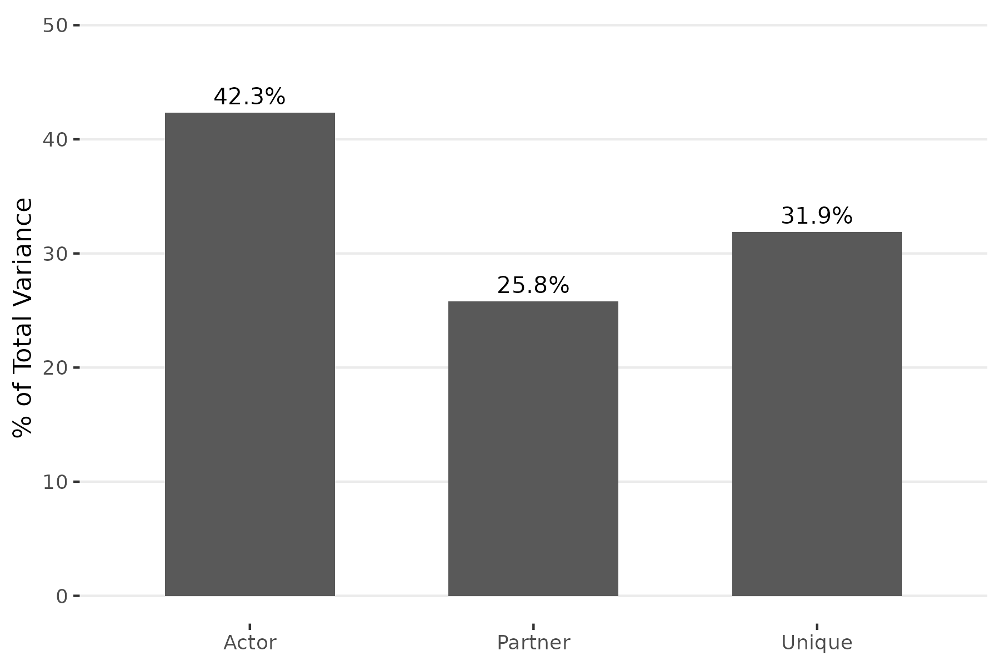
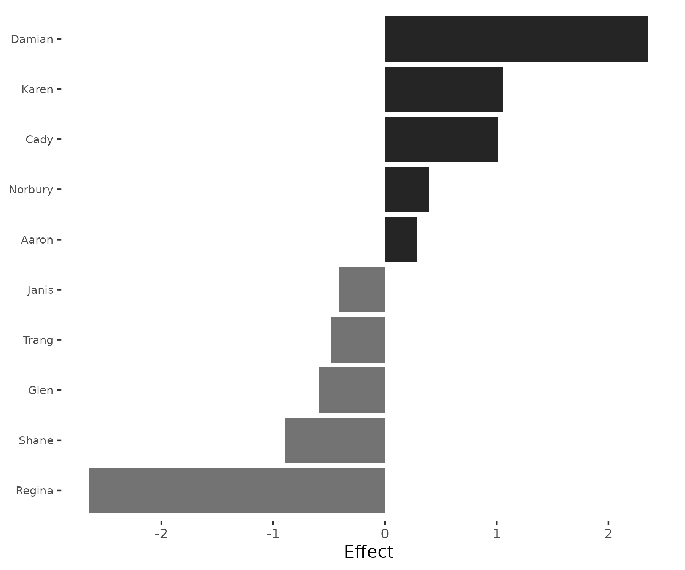
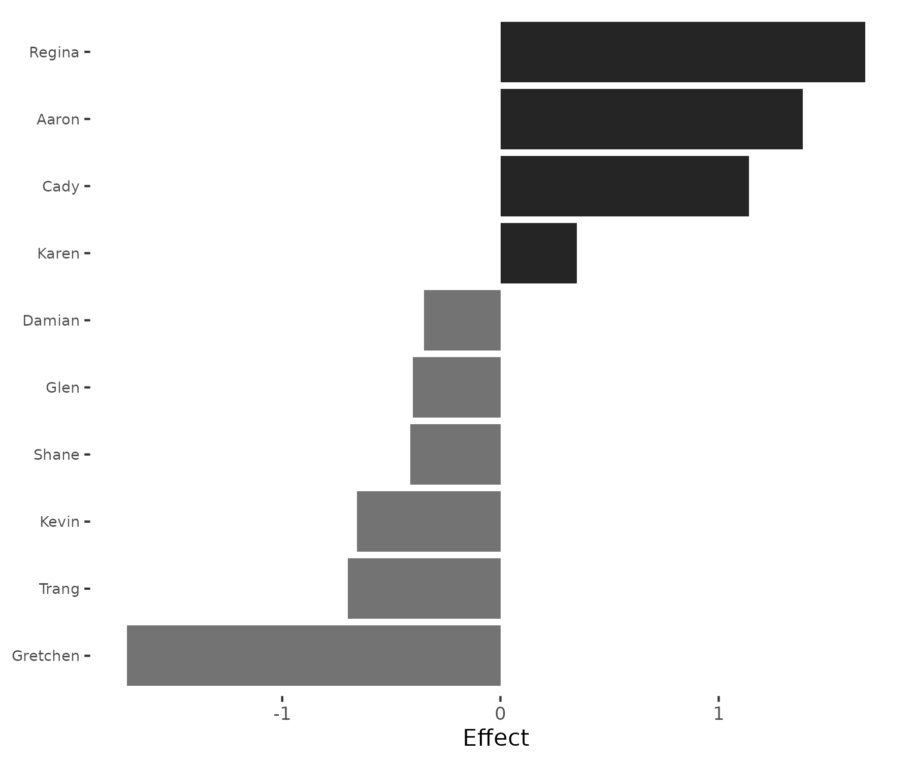
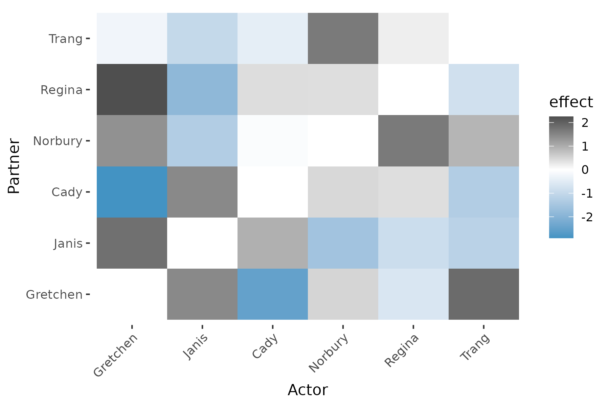
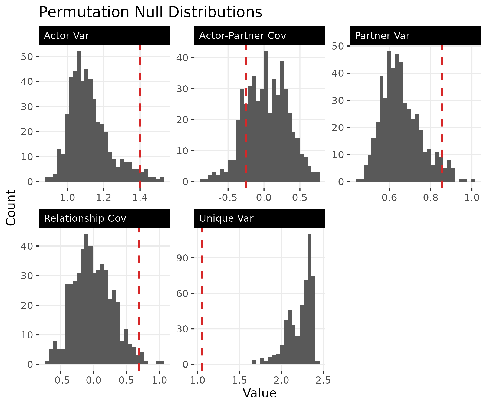
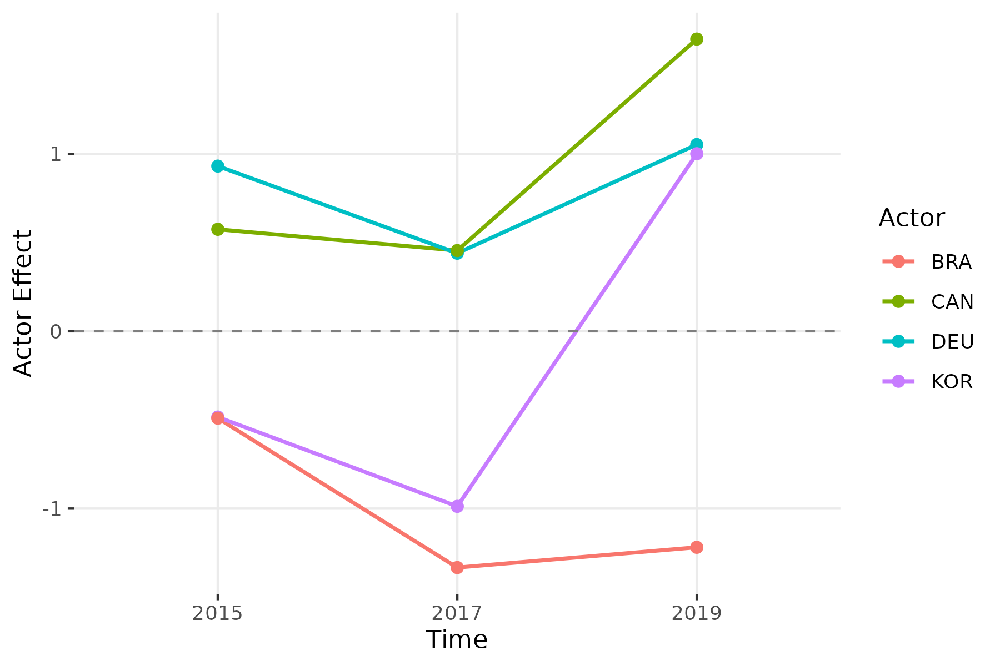
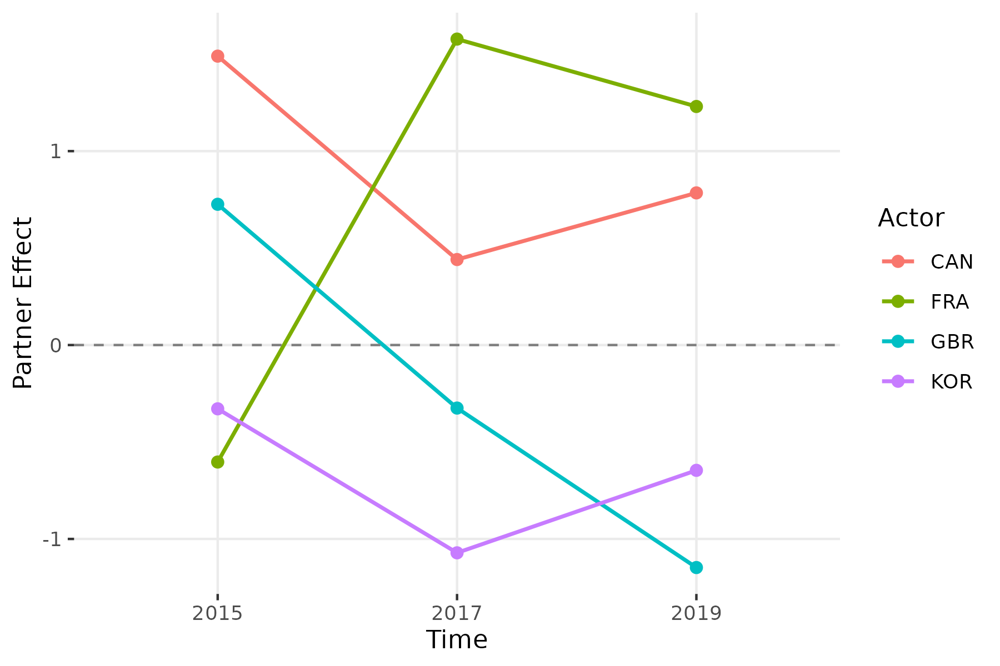
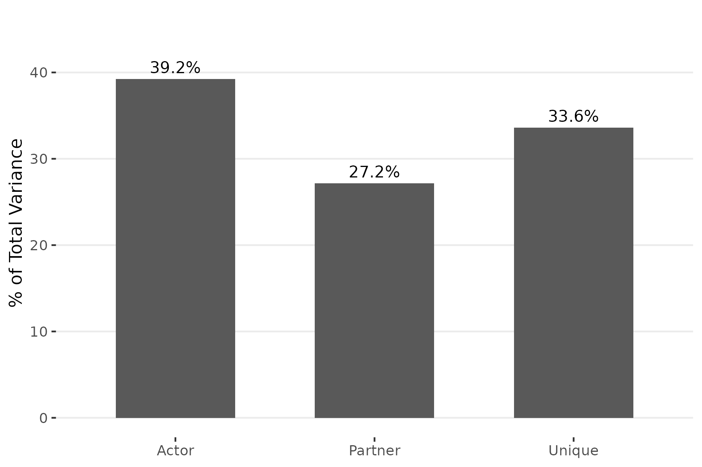
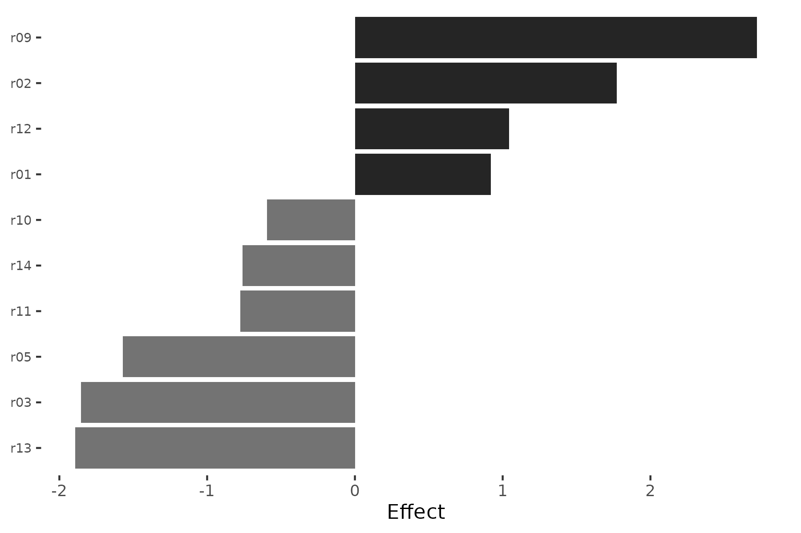

# The netify-srm Pipeline

## Overview

The `srm` package is part of the **netify ecosystem** of R packages for
network analysis:

- **netify**: Network construction and general analysis
- **lame**: Latent and Multiplicative Effects models
- **sir**: Social Influence Regression models
- **dbn**: Dynamic Bilinear Network models

The SRM decomposition is a natural first step before fitting more
complex models. It answers: *How much of the variation in this network
is due to sender behavior, receiver behavior, and relationship-specific
factors?*

This vignette walks through a complete analysis pipeline: converting raw
data to networks with `netify`, decomposing directed networks with
`srm`, testing significance via permutation, tracking change over time,
and validating with simulation.

## Step 1: From dyadic data to networks

We begin with the ATOP East Asia consultation agreements included in the
package.

``` r
library(srm)
library(netify)

data("atop_EA")
head(atop_EA)
  year country1 country2
1 2010      USA      KOR
2 2011      USA      KOR
3 2012      USA      KOR
4 2013      USA      KOR
5 2014      USA      KOR
6 2015      USA      KOR
```

The data is a dyad-year data frame: each row records a consultation
agreement between two countries in a given year. We use `netify` to
convert this into an adjacency matrix and pass it directly to
[`srm()`](https://netify-dev.github.io/srm/reference/srm.md):

``` r
net_cross = netify::netify(
  input = atop_EA, actor1 = "country1", actor2 = "country2",
  symmetric = TRUE, sum_dyads = TRUE, diag_to_NA = TRUE,
  missing_to_zero = TRUE
)

fit_atop = srm(net_cross)
fit_atop
Social Relations Model
---------------------------------------- 
Mode:       unipartite
Actors:     18
Grand mean: 1.0196

Variance Decomposition:
  Actor          0.6475  (  9.0%)
  Partner        0.6475  (  9.0%)
  Unique         5.8607  ( 81.9%)
  Relationship   5.8607  (cov)
  Actor-Partner   0.6475  (cov)
```

Because this network is symmetric (undirected), actor and partner
effects are identical, which constrains the variance decomposition:
actor and partner variance are equal, and relationship covariance equals
unique variance. To separate sender behavior from receiver behavior, we
need directed data.

## Step 2: Cross-sectional SRM with directed data

The `classroom` dataset is a 12 x 12 matrix of friendship ratings among
students at North Shore High (inspired by *Mean Girls*), where student
$i$’s rating of student $j$ need not equal $j$’s rating of $i$.

``` r
data("classroom")
fit = srm(classroom)
fit
Social Relations Model
---------------------------------------- 
Mode:       unipartite
Actors:     12
Grand mean: 3.5077

Variance Decomposition:
  Actor          1.4000  ( 42.3%)
  Partner        0.8539  ( 25.8%)
  Unique         1.0546  ( 31.9%)
  Relationship   0.6885  (cov)
  Actor-Partner  -0.2525  (cov)
```

With directed data, the three variance components are now distinct:
actor variance (42.3%) captures differences in how generously students
rate others on average, partner variance (25.8%) captures differences in
how highly students are rated by others, and unique variance (31.9%)
captures relationship-specific deviations. Actor effects are the largest
component — individual sending tendencies (generosity vs. selectivity)
are the dominant source of variation in this network.

The covariances are also informative. The positive relationship
covariance (0.69) indicates reciprocity: if student $i$ rates $j$ above
average, $j$ tends to rate $i$ above average as well. The negative
actor-partner covariance (-0.25) captures a classic Queen Bee dynamic:
generous raters (like Damian) are not the most popular, while the most
popular student (Regina) is the stingiest rater.

### Variance partition

``` r
plot(fit, type = "variance")
```



The variance partition shows that sender tendencies are the largest
source of variation, followed by relationship-specific effects and then
receiver popularity. All three components contribute meaningfully.

### Who rates most generously? Who is rated most highly?

``` r
plot(fit, type = "actor")
```



Damian has the largest positive actor effect (+2.36), meaning he rates
peers well above the class average. He’s the warmest rater at North
Shore High. Regina (-2.64) and Shane (-0.89) have the most negative
actor effects — Regina rates strategically low, consistent with her role
as the selective Queen Bee.

``` r
plot(fit, type = "partner")
```



The partner effects tell the opposite side: Regina is the most popular
(highest partner effect, +1.67), while Gretchen is rated lowest by peers
(-1.71) — “and none for Gretchen Wieners.” Notice that Regina has the
most negative actor effect but the strongest positive partner effect —
she is the stingiest rater but the most admired student. A classic Queen
Bee dynamic. Aaron (+1.39) and Cady (+1.14) are also popular, while
Kevin (-0.66) and Trang (-0.70) sit at the bottom.

### Dyadic effects

``` r
plot(fit, type = "dyadic", n = 6)
```



The heatmap of unique effects shows relationship-specific deviations
after removing actor and partner tendencies. Dark cells indicate pairs
whose mutual ratings exceed what their individual tendencies would
predict (positive unique effects); blue cells indicate pairs who rate
each other lower than expected (negative unique effects); white cells
are close to predicted.

### Test significance

Permutation testing assesses whether the observed variance components
are larger than expected under random relabeling of actors:

``` r
pt = permute_srm(fit, n_perms = 500, seed = 6886)
print(pt)
SRM Permutation Test
Permutations: 500
-------------------------------------------------- 
Component                Observed Mean(Null)      p
-------------------------------------------------- 
Actor Var                  1.4000     1.1212  0.034 *
Partner Var                0.8539     0.6576  0.046 *
Unique Var                 1.0546     2.2189  1.000 
Relationship Cov           0.6885    -0.0048  0.018 *
Actor-Partner Cov         -0.2525     0.0315  0.806 
---
Signif. codes: 0 '***' 0.001 '**' 0.01 '*' 0.05 '.' 0.1
```

Both actor and partner variance are significant ($p < 0.05$), confirming
that the heterogeneity in sending and receiving behavior is not an
artifact of chance. The relationship covariance is also significant
($p < 0.05$), providing evidence of genuine reciprocity — friends rate
each other well. The actor-partner covariance is not significant
($p > 0.8$), so the Queen Bee pattern (negative correlation between
giving and receiving) should be interpreted cautiously.

The unique variance has $p = 1.0$ because permutation preserves marginal
totals: after shuffling, dyadic noise increases, so the observed unique
variance is always smaller than the null. This is expected and does not
mean dyadic effects are absent.

``` r
plot(pt)
```



The null distributions show where the observed statistics (vertical
lines) fall relative to the permuted values. Actor, partner, and
relationship covariance sit in the right tail of their null
distributions, while unique variance sits in the left tail.

## Step 3: Longitudinal analysis

The `trade_net` dataset contains simulated bilateral trade intensity
matrices for 10 countries at three time points (2015, 2017, 2019).
Because trade flows are directed — exports from $i$ to $j$ differ from
exports from $j$ to $i$ — the decomposition produces distinct actor and
partner components at each period.

``` r
data("trade_net")
fit_long = srm(trade_net)
fit_long
Social Relations Model
---------------------------------------- 
Mode:       unipartite
Time points: 3
Actors:      10
Grand mean:  2.0433 (avg)

Variance Decomposition:
  Actor          0.5879  ( 33.0%)
  Partner        0.5259  ( 29.5%)
  Unique         0.6663  ( 37.4%)
  Relationship   0.3575  (cov)
  Actor-Partner   0.2259  (cov)
```

Averaged across periods, actor variance (33.0%) and partner variance
(29.5%) are comparable, with unique effects at 37.4%. The positive
relationship covariance (0.36) reflects trade reciprocity, and the
positive actor-partner covariance (0.23) means that countries which
export heavily also tend to import heavily.

### Stability of positions over time

Do countries maintain their relative positions as exporters and
importers across periods?

``` r
srm_stability(fit_long, type = "actor")
  time1 time2 correlation  n
1  2015  2017  0.08276307 10
2  2017  2019  0.20194660 10
```

Actor effect correlations are low: 0.08 between 2015 and 2017, and 0.20
between 2017 and 2019. Countries’ relative export positions shift
substantially between periods.

``` r
srm_stability(fit_long, type = "partner")
  time1 time2 correlation  n
1  2015  2017 -0.01160051 10
2  2017  2019  0.55719339 10
```

Partner effects are similarly unstable (correlation of -0.01 between
2015–2017, rising to 0.56 between 2017–2019). The import side shows more
continuity in the later period, but both sender and receiver roles are
reshuffled across time.

### Tracking specific countries

Use
[`srm_trends()`](https://netify-dev.github.io/srm/reference/srm_trends.md)
to extract actor or partner effects as a tidy data frame across time
points:

``` r
srm_trends(fit_long, type = "actor", actors = c("CAN", "DEU", "BRA", "KOR"))
   actor time    effect
3    DEU 2015  0.931250
7    KOR 2015 -0.483875
9    BRA 2015 -0.490500
10   CAN 2015  0.574875
13   DEU 2017  0.440125
17   KOR 2017 -0.987500
19   BRA 2017 -1.332625
20   CAN 2017  0.455000
23   DEU 2019  1.052625
27   KOR 2019  1.000875
29   BRA 2019 -1.218500
30   CAN 2019  1.647625
```

Canada’s actor effect jumps from 0.57 in 2015 to 1.65 in 2019, ending as
the strongest relative exporter. South Korea reverses from -0.99 in 2017
to 1.00 in 2019. Brazil is consistently negative across all three
periods. Germany remains a positive exporter throughout (0.93, 0.44,
1.05).

``` r
srm_trend_plot(fit_long, type = "actor", n = 4)
```



``` r
srm_trends(fit_long, type = "partner", actors = c("CAN", "FRA", "KOR", "CHN"))
   actor time    effect
2    CHN 2015 -1.386625
6    FRA 2015 -0.603250
7    KOR 2015 -0.328875
10   CAN 2015  1.489875
12   CHN 2017  0.137375
16   FRA 2017  1.577750
17   KOR 2017 -1.071500
20   CAN 2017  0.441000
22   CHN 2019 -0.019250
26   FRA 2019  1.230250
27   KOR 2019 -0.646125
30   CAN 2019  0.784625
```

On the import side, France shows the most dramatic shift, moving from
-0.60 in 2015 to +1.58 in 2017, indicating a sharp increase in relative
import intensity. South Korea’s partner effect is consistently negative
(-0.33 to -1.07), meaning it receives less trade than its peers. Canada
maintains a positive partner effect across all periods.

``` r
srm_trend_plot(fit_long, type = "partner", n = 4)
```



## Step 4: Simulation for validation

To build confidence in the decomposition, we verify that it can recover
known parameters from simulated data. We generate a directed network
with specified variance components:

``` r
sim = sim_srm(
  n_actors = 25,
  actor_var = 2.0,
  partner_var = 1.0,
  unique_var = 3.0,
  actor_partner_cov = 0.5,
  relationship_cov = 0.3,
  grand_mean = 1.0,
  seed = 6886
)

fit_sim = srm(sim$Y)
summary(fit_sim)
Social Relations Model - Variance Decomposition
================================================== 

Component                Variance  % Total
------------------------------------------ 
Actor                      1.8088    29.6%
Partner                    1.1009    18.0%
Unique                     3.2102    52.5%
Relationship (cov)         0.3815       --
Actor-Partner (cov)        0.6384       --
```

Compare the true parameters against the SRM estimates:

``` r
data.frame(
  Component = c("Actor var", "Partner var", "Unique var",
                "Relationship cov", "Actor-partner cov"),
  True = c(2.0, 1.0, 3.0, 0.3, 0.5),
  Estimated = round(fit_sim$stats$variance, 2)
)
          Component True Estimated
1         Actor var  2.0      1.81
2       Partner var  1.0      1.10
3        Unique var  3.0      3.21
4  Relationship cov  0.3      0.38
5 Actor-partner cov  0.5      0.64
```

The variance components recover the true values reasonably well: actor
variance (1.81 vs. 2.0), partner variance (1.10 vs. 1.0), and unique
variance (3.21 vs. 3.0) are all in the right neighborhood of their
targets. The covariance estimates (relationship: 0.38 vs. 0.3;
actor-partner: 0.64 vs. 0.5) show more sampling variability —
covariances are harder to estimate precisely from a single network,
especially with only 25 actors. The relative ordering is preserved —
unique variance is largest, actor variance is roughly double partner
variance — confirming that the decomposition correctly identifies the
structure of the data generating process.

## Step 5: Bipartite (two-mode) networks

When senders and receivers belong to different populations, the network
is bipartite and the decomposition simplifies. There is no reciprocity
structure or actor-partner covariance; only actor variance, partner
variance, and unique variance are estimated. We demonstrate with a
simulated two-mode network of 15 senders and 20 receivers:

``` r
sim_bip = sim_srm(
  n_actors = c(15, 20),
  bipartite = TRUE,
  actor_var = 2.0,
  partner_var = 1.0,
  unique_var = 1.5,
  grand_mean = 3.0,
  seed = 6886
)

fit_bip = srm(sim_bip$Y)
fit_bip
Social Relations Model
---------------------------------------- 
Mode:       bipartite
Actors:     15
Grand mean: 1.8408

Variance Decomposition:
  Actor          1.6468  ( 39.2%)
  Partner        1.1406  ( 27.2%)
  Unique         1.4111  ( 33.6%)
```

The bipartite SRM reports only three variance components (no
covariances). Actor variance captures differences among the 15 senders;
partner variance captures differences among the 20 receivers. The
variance partition reveals which side of the network drives more
heterogeneity.

``` r
plot(fit_bip, type = "variance")
```



Actor and partner effects can be visualized the same way as for
unipartite networks:

``` r
plot(fit_bip, type = "actor")
```



The bar chart shows the 15 senders sorted by absolute effect size.
Senders with positive effects (dark bars) send higher values than the
network average; senders with negative effects (gray bars) send lower
than average. Because the network is simulated from known parameters,
the spread of effects reflects the `actor_var = 2.0` we specified.

Bipartite networks also support longitudinal analysis. Pass a list of
rectangular matrices to
[`srm()`](https://netify-dev.github.io/srm/reference/srm.md), and all
the longitudinal tools (`srm_trends`, `srm_stability`, `srm_trend_plot`)
work as expected.

## Summary

The `srm` package provides a descriptive decomposition complementary to
the model-based approaches in `lame`, `sir`, and `dbn`. A typical
analysis pipeline:

1.  **Construct** the network from raw data using `netify`, or supply a
    matrix directly
2.  **Decompose** with
    [`srm()`](https://netify-dev.github.io/srm/reference/srm.md) to
    partition variation into actor, partner, and dyadic components
3.  **Visualize** actor effects, partner effects, dyadic heatmaps, and
    variance partitions with
    [`plot()`](https://rdrr.io/r/graphics/plot.default.html)
4.  **Test** significance via
    [`permute_srm()`](https://netify-dev.github.io/srm/reference/permute_srm.md)
    to assess whether components exceed chance levels
5.  **Track** longitudinal change with
    [`srm_stability()`](https://netify-dev.github.io/srm/reference/srm_stability.md)
    and
    [`srm_trend_plot()`](https://netify-dev.github.io/srm/reference/srm_trend_plot.md)
6.  **Validate** with
    [`sim_srm()`](https://netify-dev.github.io/srm/reference/sim_srm.md)
    to confirm that the decomposition recovers known parameters

## References

Dorff, Cassy, and Michael D. Ward. (2013). Networks, Dyads, and the
Social Relations Model. *Political Science Research Methods*
1(2):159-178.

Dorff, Cassy, and Shahryar Minhas. (2017). When Do States Say Uncle?
Network Dependence and Sanction Compliance. *International Interactions*
43(4):563-588.
