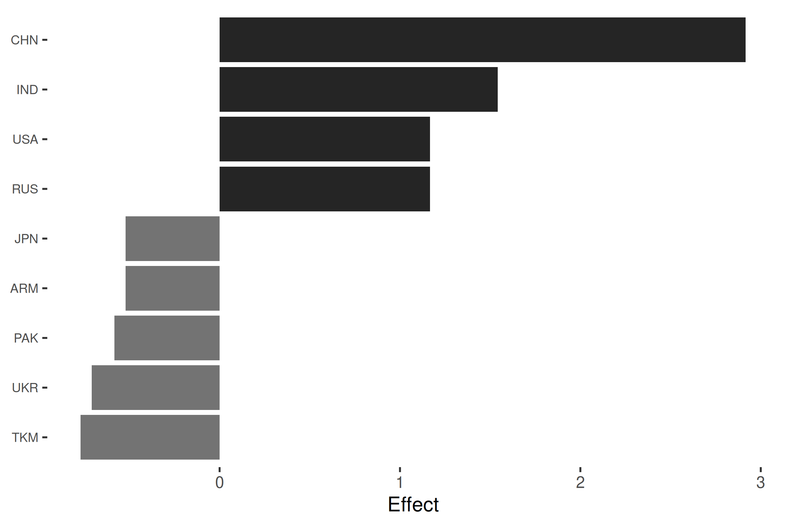
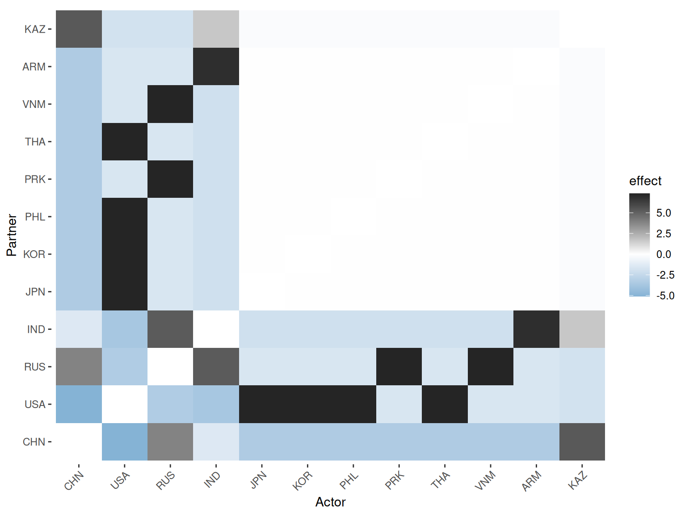
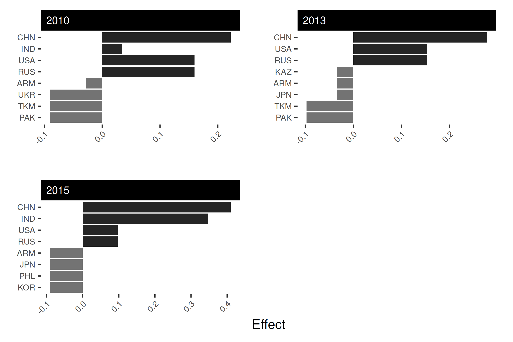
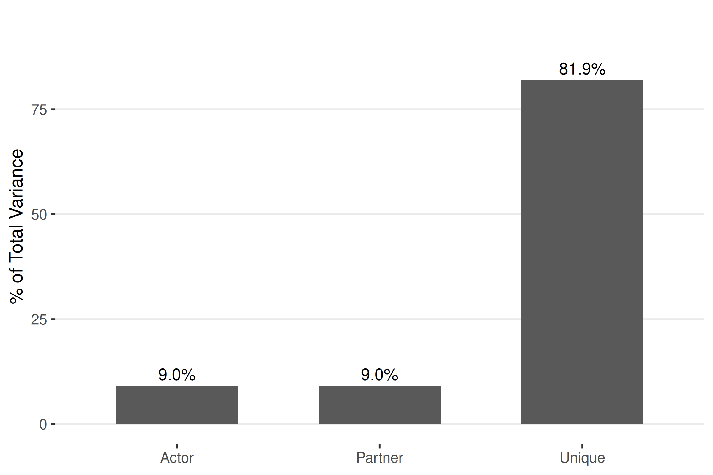

# Social Relations Models for Network Analysis

## Package Overview

This vignette introduces the `srm` package, which estimates social
relations models for network data. It breaks down and analyzes networks
into nodal and dyadic dependencies and allows users to understand actor,
partner, and dyadic effects in network data (Dorff and Ward, 2013; Dorff
and Minhas, 2017).

**What users can do:**

1.  **Identify the most active actors in the network** - both in terms
    of sender and receiver patterns. Users can identify which actors are
    more active than expected after accounting for overall network
    structure and partner characteristics.

2.  **Identify overall network patterns** where users can separate
    systematic actor behaviors from relationship-specific effects.

3.  **Generate specific summary statistics for the network data** that
    can reveal whether active actors are also active receivers.

4.  **Create visualizations** to visualize actor behaviors and their
    relationship-specific patterns.

**In comparison to `netify`**, which provides general network statistics
and visualizations, the srm package helps users break down network
relationships allowing for deeper analysis. With `srm`, users are able
to identify which actors are more or less active than typical and helps
users explore why, relationally, some connections are stronger or weaker
than expected. While `netify` focuses on overall network patterns, srm
centers on explaining the individual behaviors and relationships that
drive those patterns.

**Note:** This vignette uses symmetric (undirected) network data, which
constrains the SRM decomposition. If you have **directed** data where
sender and receiver roles are distinct, the `pipeline` vignette provides
a more complete walkthrough with all five SRM components. For
**bipartite** (two-mode) networks, see the `bipartite` vignette.

## Load Packages

``` r
library(netify)
library(srm)
```

## Prepare Data

We will make use of data from ATOP (Alliance Treaty Obligations and
Provisions) to demonstrate how to use the `srm` package. The data can be
downloaded at <http://www.atopdata.org>. For this tutorial, we have
selected the `atop5_1dy` dataset and focus on military security
consultation agreements from 2010 to 2018 involving countries in the
broader East and Central Asian region. The dataset includes 18
countries: the East Asian core (China, India, Japan, South Korea, North
Korea, Philippines, Thailand, Vietnam) along with their consultation
treaty partners (Armenia, Kazakhstan, Kyrgyzstan, Pakistan, Russia,
Tajikistan, Turkmenistan, Ukraine, USA, Uzbekistan).

``` r
data("atop_EA")
head(atop_EA)
  year country1 country2
1 2010      USA      KOR
2 2011      USA      KOR
3 2012      USA      KOR
4 2013      USA      KOR
5 2014      USA      KOR
6 2015      USA      KOR
```

We will make use of the `netify` package to make a network object from
the ATOP data. We will create two network objects, one for
cross-sectional data and the other for longitudinal data as examples for
this vignette. Note that these consultation agreements are symmetric
(undirected) – if country A has a consultation agreement with country B,
the reverse is also true.

``` r
# cross-sectional
atop_EA_short = netify::netify(
  input = atop_EA,
  actor1 = 'country1',
  actor2 = 'country2',
  symmetric = TRUE,
  sum_dyads = TRUE,
  diag_to_NA = TRUE,
  missing_to_zero = TRUE
)

# longitudinal
atop_EA_long = netify::netify(
  input = atop_EA,
  actor1 = 'country1',
  actor2 = 'country2',
  time = 'year',
  symmetric = TRUE,
  sum_dyads = TRUE,
  diag_to_NA = TRUE,
  missing_to_zero = TRUE
)
```

See
[`?netify::netify`](https://netify-dev.github.io/netify/reference/netify.html)
for details on the parameters used above. The `netify` function creates
a network object that can be used with the `srm` package. The resulting
object is a matrix for cross-sectional data and a list of matrices for
longitudinal data, where each matrix represents the network at a
specific time point.

**A note on symmetric networks:** Because these consultation agreements
are undirected, the resulting matrices are symmetric. In symmetric
networks, actor effects and partner effects are identical by
construction – a country’s tendency to “send” ties is the same as its
tendency to “receive” them. The SRM is most informative for directed
(asymmetric) networks where sender and receiver roles are distinct. We
use this symmetric example here for illustration, but see the
`classroom` dataset for an example with asymmetric data where the full
SRM decomposition is more revealing.

## SRM Summary Statistics

Now that we have our network objects, we can analyze relationships in
the network via the `srm` package. Let’s begin by generating summary
statistics for the network data. We will look at the row means and
actor-partner covariance for the cross-sectional data.

``` r
sort(srm_stats(atop_EA_short, type = "rowmeans"), decreasing = TRUE)

[36mℹ
[39m Converting 
[34m
[34m<netify>
[34m
[39m object to standard matrices.
      CHN       IND       RUS       USA       KAZ       KGZ       TJK       UZB 
3.7647059 2.4705882 2.1176471 2.1176471 0.7647059 0.7647059 0.7647059 0.7647059 
      ARM       JPN       KOR       PHL       PRK       THA       VNM       PAK 
0.5294118 0.5294118 0.5294118 0.5294118 0.5294118 0.5294118 0.5294118 0.4705882 
      UKR       TKM 
0.3529412 0.2941176 
```

The row means immediately reveal the most active countries: China (3.76)
and India (2.47) have far more consultation agreements on average than
countries like Turkmenistan (0.29) or Ukraine (0.35). Note the sharp
drop-off after the top four (China, India, Russia, USA), with most
countries clustered between 0.3 and 0.8.

``` r
srm_stats(atop_EA_short, type = "actor_partner_cov")

[36mℹ
[39m Converting 
[34m
[34m<netify>
[34m
[39m object to standard matrices.
[1] 0.6474946
```

The actor-partner covariance of 0.65 is positive, but this is a direct
consequence of the network being symmetric: because every consultation
tie is mutual, actor and partner effects are identical and the
actor-partner covariance equals the actor variance by construction. In a
directed network, this covariance would reveal whether active senders
also tend to be active receivers; here, that question is not separable
from general activity.

Let’s make use of the `time` argument and look at the column means for
select years in the longitudinal data. New treaties entered the ATOP
data between 2012 and 2015, so we select years that span these changes.

``` r
yrs = c("2010", "2013", "2015")

col_means = srm_stats(atop_EA_long, type = "colmeans", time = yrs)

[36mℹ
[39m Converting 
[34m
[34m<netify>
[34m
[39m object to standard matrices.
```

With 18 countries across 3 years, the full output is large. We can
compare a few key countries:

``` r
focus = c("CHN", "IND", "RUS", "USA")
sapply(col_means, function(x) round(x[focus], 2))
    2010 2013 2015
CHN 0.29 0.35 0.53
IND 0.12 0.12 0.47
RUS 0.24 0.24 0.24
USA 0.24 0.24 0.24
```

China’s consultation activity increases from 0.29 in 2010 to 0.35 in
2013 and 0.53 by 2015, reflecting new agreements entering the dataset.
India holds steady at 0.12 through 2013 and then jumps to 0.47 in 2015.
Russia and the USA remain stable at 0.24 throughout.

## SRM Effects

We can analyze the actor, partner, and unique effects in the network
data using the
[`srm_effects()`](https://netify-dev.github.io/srm/reference/srm_effects.md)
function. The actor effect for observation *i* captures how much that
actor deviates from the network average as a sender of ties. It is
calculated as:

$${\widehat{a}}_{i} = \frac{(n - 1)^{2}}{n(n - 2)}X_{i.} + \frac{(n - 1)}{n(n - 2)}X_{.i} - \frac{n - 1}{n - 2}\bar{X}$$

where $X_{i.}$ is the row mean for actor *i*, $X_{.i}$ is the column
mean, and $\bar{X}$ is the overall network mean.

Similarly, the partner effect shows how much actor *i* tends to receive
ties above or below average:

$${\widehat{b}}_{i} = \frac{(n - 1)^{2}}{n(n - 2)}X_{.i} + \frac{(n - 1)}{n(n - 2)}X_{i.} - \frac{n - 1}{n - 2}\bar{X}$$

We look at the actor effects for the cross-sectional data:

``` r
EA_actor = srm_effects(atop_EA_short, type = "actor")

[36mℹ
[39m Converting 'netify' matrix to standard matrix.
sort(EA_actor[, 1], decreasing = TRUE)
       CHN        IND        RUS        USA        KAZ        KGZ        TJK 
 2.9166667  1.5416667  1.1666667  1.1666667 -0.2708333 -0.2708333 -0.2708333 
       UZB        ARM        JPN        KOR        PHL        PRK        THA 
-0.2708333 -0.5208333 -0.5208333 -0.5208333 -0.5208333 -0.5208333 -0.5208333 
       VNM        PAK        UKR        TKM 
-0.5208333 -0.5833333 -0.7083333 -0.7708333 
```

The actor effects show how much an actor deviates from the network
average in security consultation pacts. China has the highest positive
actor effect (+2.92), meaning it engages in security consultation pacts
far more than the network average. Other countries such as Thailand,
Japan, and Korea have negative effects (around -0.52), suggesting they
participate below the network average.

We can also look at the unique effects. The unique dyadic effect is the
residual after removing both actor and partner tendencies:

$${\widehat{g}}_{ij} = X_{ij} - {\widehat{a}}_{i} - {\widehat{b}}_{j} - \bar{X}$$

We run this from the `srm_effects` function with `type = "unique"`.

``` r
EA_unique = srm_effects(atop_EA_short, type = "unique")

[36mℹ
[39m Converting 'netify' matrix to standard matrix.
```

The unique effects are an 18x18 matrix. Rather than printing the full
matrix, we can identify the strongest bilateral relationships by sorting
the off-diagonal values:

``` r
g_vec = EA_unique[row(EA_unique) != col(EA_unique)]
names(g_vec) = outer(
  rownames(EA_unique), colnames(EA_unique), paste, sep = "-"
)[row(EA_unique) != col(EA_unique)]
head(sort(g_vec, decreasing = TRUE), 6)
 USA-JPN  USA-KOR  USA-PHL  RUS-PRK  PRK-RUS  VNM-RUS 
7.334559 7.334559 7.334559 7.334559 7.334559 7.334559 
```

The top unique effects all have the same value (+7.3) because the ATOP
consultation data is binary and symmetric: once actor and partner
tendencies are removed, the remaining dyadic effects are strongly
constrained. The pairs highlighted — USA-Japan, USA-Korea,
USA-Philippines, and Russia-North Korea — are the alliances that exist
despite both partners having relatively low overall activity. In a
directed, continuous-valued network, unique effects would show more
differentiation across dyads; see the `pipeline` vignette for such an
example.

For the longitudinal data, we extract actor effects for selected years.
Because the network is symmetric, actor and partner effects are
identical, so we focus on actor effects only.

``` r
EA_actor_long = srm_effects(atop_EA_long, type = "actor", time = yrs)

[36mℹ
[39m Converting one or more 'netify' matrices in the list to standard matrices.
```

We can compare China and India’s actor effects across these three years
to see how their consultation activity evolved:

``` r
sapply(EA_actor_long, function(x) round(x[c("CHN", "IND"), 1], 2))
    2010 2013 2015
CHN 0.22 0.28 0.41
IND 0.03 0.03 0.35
```

China’s actor effect grows from +0.22 in 2010 to +0.41 by 2015 as new
agreements enter the data. India starts near the network average in 2010
(+0.03) and jumps to +0.35 in 2015, reflecting the same wave of new
consultation agreements visible in the column means above.

## Visualization

We can visualize the actor, partner, or dyadic effects using the
`srm_plot` function. The actor/partner effect plots show actors sorted
by the absolute magnitude of their effects, with positive effects in
dark bars and negative effects in light gray bars. The default number of
actors shown is the top 10, adjustable via the `n` argument.

**Things to note:**

1.  Users need to put in results from the `srm_effects` function as
    input to the `srm_plot` function.

2.  For undirected networks, use `type = "actor"` when plotting since
    partner effects are identical.

We look at the actor effects for the cross-sectional data:

``` r
srm_plot(EA_actor, type = "actor", n = 9)
```



Positive effects are shown in dark bars (right side) and negative
effects in light gray bars (left side). China has the highest positive
effect, engaging in military consultation obligations significantly more
than the network average. Countries such as Turkmenistan have the
strongest negative effects.

We can also look at the dyadic effects. When users supply the unique
effects, the function returns a heatmap with a diverging color scale.
Dark cells indicate stronger-than-expected relationships (positive
unique effects), blue cells indicate weaker-than-expected relationships
(negative unique effects), and white cells are close to what we would
predict from actor tendencies alone.

``` r
srm_plot(EA_unique, type = "dyadic", n = 12)
```



The heatmap reveals which bilateral relationships are unusually strong
or weak after controlling for each actor’s general tendencies. For
example, the USA has strong military consultation relationships with
Japan, Korea, and Thailand beyond what their general activity levels
would predict. Most cells are white, showing that many bilateral
relationships are close to what we would expect.

For the longitudinal data, we can set `facet = TRUE` to compare actor
effects across time periods:

``` r
srm_plot(EA_actor_long, type = "actor", facet = TRUE, time = yrs, n = 8)
```



The faceted plot shows how actor effects evolve over time. China
consistently has the highest positive actor effect. India’s effect grows
across the periods as new consultation agreements enter the data. Other
countries with light gray bars have negative effects, suggesting
below-average consultation activity.

## Using the Unified Interface

The examples above use the original component functions (`srm_effects`,
`srm_stats`, `srm_plot`). The package also provides a unified
[`srm()`](https://netify-dev.github.io/srm/reference/srm.md) function
that computes everything at once, returning a single object with
`print`, `summary`, and `plot` methods. The
[`srm()`](https://netify-dev.github.io/srm/reference/srm.md) approach is
more concise for a typical analysis:

``` r
fit = srm(atop_EA_short)

[36mℹ
[39m Converting 
[34m
[34m<netify>
[34m
[39m object to standard matrices.

[36mℹ
[39m NAs found in input; replacing with zero.
summary(fit)
Social Relations Model - Variance Decomposition
================================================== 

Component                Variance  % Total
------------------------------------------ 
Actor                      0.6475     9.0%
Partner                    0.6475     9.0%
Unique                     5.8607    81.9%
Relationship (cov)         5.8607       --
Actor-Partner (cov)        0.6475       --
```

Because this is a symmetric (undirected) network, the variance
decomposition is heavily constrained: actor and partner variance are
equal (both 9%), while unique variance dominates at 82%. The
relationship covariance equals the unique variance and the actor-partner
covariance equals the actor variance, all by construction. The SRM
cannot distinguish sender behavior from receiver behavior here.

``` r
plot(fit, type = "variance")
```



The lopsided 9% / 9% / 82% split is typical for symmetric networks and
reflects the structural constraints rather than a substantive finding.
For directed networks, the decomposition is far more informative. The
`classroom` dataset (a directed friendship network) produces a 42% / 26%
/ 32% split across distinct actor, partner, and unique components, with
sender tendencies dominating. See the `pipeline` vignette for a complete
directed-data walkthrough.

## Conclusion

This vignette demonstrated the core `srm` workflow using ATOP
consultation data: computing row and column means, decomposing actor and
dyadic effects, and visualizing the results. China and India stand out
as the most active consultation partners, and the strongest
relationship-specific effects belong to alliances like USA-Japan and
USA-Korea. Because this dataset is symmetric (undirected), the SRM
decomposition is structurally constrained — actor and partner effects
are identical and the variance partition is dominated by unique effects.
For directed-data examples where all five SRM components are distinct,
see the `pipeline` and `methodology` vignettes.

**References**:

Dorff, Cassy, and Michael D. Ward. (2013) Networks, Dyads, and the
Social Relations Model. Political Science Research Methods 1(2):159-178.

Dorff, Cassy, and Shahryar Minhas. (2017). When Do States Say Uncle?
Network Dependence and Sanction Compliance. International Interactions
43(4): 563-588.

Leeds, Brett Ashley, Jeffrey M. Ritter, Sara McLaughlin Mitchell, and
Andrew G. Long. 2002. Alliance Treaty Obligations and Provisions,
1815-1944. International Interactions 28: 237-260.
